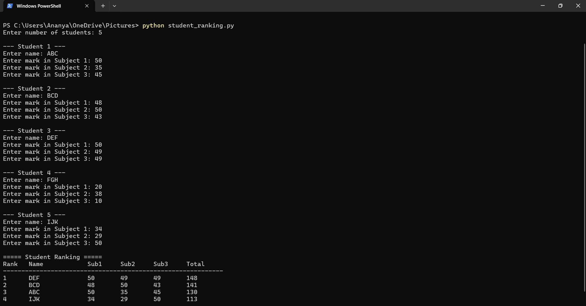

#  Student Ranking System Using Custom Sorting  

This project allows you to **rank students automatically based on their total marks** using a **custom sorting technique in Python**.  

If two students get the same total marks, they are sorted **alphabetically by name**.

---

## 📂 Working Structure  

Keep the Python file inside one folder:

---

